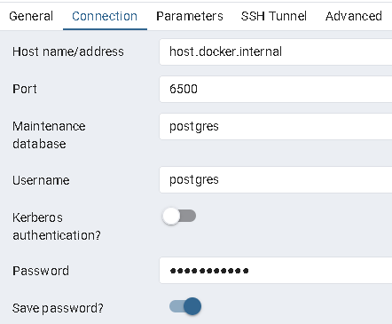

## Initial Setup

1. setup env folder based on .env.example (copy into .env and update as needed)
2. `docker-compose up -d`
   1. you may need to delete the `ikc-data` volume if anything major in the db schema is altered, to ensure that it is reset, in a production environment there are better ways with prisma specific commands but for now this should be fine as a mitigation
3. `npm install` / `npm ci` (only need to once for below)
4. `npm run migrate` (to seed the DB if it is not already or prisma schema changes)
5. `npm run start` or `npm run dev` depending on workflow

## Additional Options

- comment out the pgAdmin & pgadmin-data volume to debug db to connect use user/pass/port in docker compose and for IP use `host.docker.internal`
  - example of above:
  - 
- use `npm run dev` for running locally, eventually will setup compose to run frontend too which then start will be for
- every-time you change the DB or add to schema.prisma you have to run `npm run migrate` to rebuild tables etc. npm run dev & start already run generate for client so that should not have to be run
